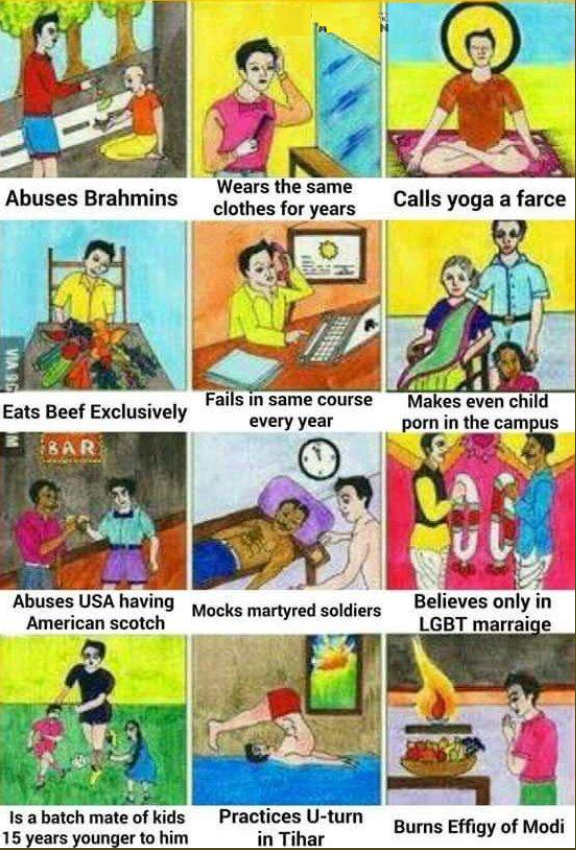

```{r setup, include=FALSE}
knitr::opts_chunk$set(echo = FALSE)
knitr::opts_knit$set(root.dir = "----") # set working directory here
```

## Overview

1. Twitter in India & the JNU Protests

2. Scraping Twitter

3. Preparing a Network Analysis

4. Analysing the #JNUProtest Network

5. Questions


# Part 1: Twitter in India & the JNU Protests

## Twitter in India

>- Twitter is used in India as an arena or even a battlefield between the “Hindu Nationalists” and “Secular liberals” (Udupa 2019)
>- Only a distinct group has access and actively uses Twitter: the Indian (urban) middle class. Twitter helps them to make political claims to the moral and political hegemony in India


## Twitter as a data source

>- Twitter can be used as an excellent and easy accessible data source for your research
>- Qualitative approach: the focus lies on the content of the tweet, the language and the themes and categories that we can identify
>- When we see the tweet as text, we can analyse the discourse linked to our research question


## The JNU Protests

>- For today’s presentation we have chosen a recent event:
  JNU students protest in Delhi against a steep hike in hostel fees and the limitation of their freedom of movement within the campus; the protest was beaten down by the police in Delhi
>- we have chosen two hashtags that were trending at the time to collect our data: #EmergencyinJNU and #JNUprotest


## The JNU Protests

{height=300px}

https://twitter.com/t_d_h_nair/status/1196367277102264320

## JNU as a Symbol

>- In India, the JNU stands for the secular and liberal India; in the past it has been seen as a “training ground” for future politicians mostly from left-wing parties
>- JNU campus itself is quite a mythical place for most students: here they can study and take part in political discussions for the first time; for many, the JNU has been an escape from the closed and tabooing Indian society (no dating or pre-marital relationships, etc.)
>- For Hindu nationalist activists, JNU and its students and professors symbolize the “enemy”, they embody the anti-national, secular and liberal India that oppose their aim to transform India into a Hindu state


## Hindu Nationalist Imaginary
<center>
{height=500px} 
</center>

## Moral Attacks

{width=50%} {width=49%}


## Moral Attacks

{height=500px}


# Part 2: Scraping Twitter

## Access to the Twitter API

>- API = Aplication programming interface. Gives access to the functions of the platform
>- API access can be applied for via https://developer.twitter.com/en/apply-for-access
>- Requires a twitter account
>- During the application, reasons for the API use must be submitted
>- Academic use is usually granted access. Make sure, however, not to violate Twitter's terms of use in the description of your project
>- Other platforms, like youtube or facebook, have APIs that can be used for scraping as well  
(In case of Facebook, however, access got extremely retricted after Cambridge Analytica)

## Access to the Twitter API

Access to the Twitter API gives you an access token that needs to be loaded into R when scraping

```{r echo = TRUE}
load("twittertoken.RDa")
```

<!-- In fact, this token first needs to be made into a dataformat usable by R.  -->
<!-- Type 'vignette("auth", package = "rtweet")' in R for more info -->


<!-- ## The Twitter APIs -->
<!-- ### Stream API -->
<!-- - works like the timeline -->
<!-- - live stream of all tweets within the specified search query -->
<!-- - caps at 1% of the global Twitter traffic -->
<!-- - good for prolonged scraping of conversations -->
<!-- - no good for getting retweets / likes -->


<!-- ## The Twitter APIs -->
<!-- ### REST API -->
<!-- - works like the Search on Twitter -->
<!-- - gets all tweets to a specific seach query, e.g. hashtag(s) -->
<!-- - limited to 18.000 tweets per call from no more than 7 days ago -->
<!-- - can also get user data, like followers or timelines (with varying call limits)   -->


<!-- ## The Twitter APIs -->
<!-- - Both APIs have an undisclosed bias, as Twitter filters Tweets according to "relevance"   -->
<!-- - Results from the two APIs can vary, however slightly   -->
<!-- - For most apllication, repeated searches of Tweets via the REST API work best   -->


<!-- ## The Twitter APIs (cont.) -->
<!-- ### Firehose API -->
<!-- - unrestricted live stream of global Twitter traffic -->
<!-- - requires vast amounts of ressources to store, and then filter, the results -->
<!-- - commercial access only   -->

<!-- \+ APIs forAdvertisement, Direct Messages, Embedment etc.  -->

## Scraping Twitter with R

>- R is a programming language with an easy-to-use interface called R Studio
>- It is free and open source
>- Mostly used for statistical applications, but very flexible
>- Additional functionality is provided by user-devloped packages
>- Popular among Social Scientists

## Scraping Twitter with the package rtweet
```{r echo = TRUE}
library(rtweet)
```

<!-- ## Scraping Twitter with the package rtweet -->
<!-- ### Stream -->
<!-- ```{r echo = TRUE} -->
<!-- stream <- stream_tweets(q, timeout = 30, token = twitter_token) -->
<!-- View(stream) -->
<!-- ``` -->

### Search
```{r echo = TRUE, message = FALSE}
search <- search_tweets(q = "#JNUProtests OR EmergencyinJNU", 
                        n = 1000, 
                        token = twitter_token)
View(search)
```
>- basically works like the search on Twitter
>- returns a maximum 18.000 tweets per call from up to 7 days ago
>- rtweet also allows to get user data, like followers or timelines, with its different functions


# Part 3: Preparing a Network Analysis

## Making tweets into a network graph

```{r echo = TRUE, message = FALSE}
library(igraph)
library(graphTweets)
```

```{r echo = TRUE}
load("JNUProtest_search.RDa")

search %>%
  gt_edges(screen_name, mentions_screen_name) %>%
  gt_nodes() %>%
  gt_graph() -> mentions_graph
```

>- Users become Nodes in the network
>- Mentions (@s, Retweets, Comments, Replies) become Edges between Nodes


## Exporting the Network Graph to Gephi

- Gephi (https://gephi.org/) is a great, free and easy to use tool for netowrk visualisation and analysis

- Standard R dataformat is not supported, we have to export our Graph

```{r echo = TRUE, message = FALSE}
library(rgexf)

nodes_df <- data.frame(ID = c(1:vcount(mentions_graph)), 
                       NAME = V(mentions_graph)$name)
edges_df <- as.data.frame(get.edges(mentions_graph, 
                       c(1:ecount(mentions_graph))))
edges_df$n <- E(mentions_graph)$n

write.gexf(nodes = nodes_df[1:2], 
           edges = edges_df[1:2], 
           edgesWeight = edges_df$n, 
           defaultedgetype = "directed", 
           output = "workshop_mentions_graph_2.gexf")
```


# Part 4: Analysing the #JNUProtest Network


# Questions?

## More Questions?

Send us an email to   
erikbecker@hotmail.de  
or  
tim.koenig@wzb.eu


## Further Readings
Bennett, W. Lance, und Barbara Pfetsch. 2018. „Rethinking Political Communication in a Time of Disrupted Public Spheres“. Journal of Communication 68 (2): 243–53. https://doi.org/10.1093/joc/jqx017.  

Bruns, Axel, und Jean Burgess. 2012. „Researching News Discussion on Twitter“. Journalism Studies 13 (5–6): 801–14. https://doi.org/10.1080/1461670X.2012.664428.  

Luke, Douglas A. 2015. A User’s Guide to Network Analysis in R. Use R! Springer International Publishing. https://doi.org/10.1007/978-3-319-23883-8.  


## Further Readings (cont.)
Maireder, Axel, und Stephan Schlögl. 2014. „24 Hours of an #outcry: The Networked Publics of a Socio-Political Debate“. European Journal of Communication 29 (6): 687–702. https://doi.org/10.1177/0267323114545710.  

Meraz, Sharon, und Zizi Papacharissi. 2013. „Networked Gatekeeping and Networked Framing on #Egypt“. The International Journal of Press/Politics 18 (2): 138–66. https://doi.org/10.1177/1940161212474472.

